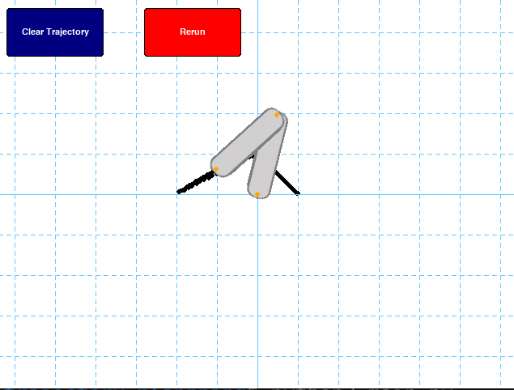

# scara_robot_trajectory_plannning
A library for planning the trajectory of the 2D scara robot using Linear Function with Parabolic Blends
# Visualization

# Requirements
```
python == 3.7.7 
pygame == 1.9.6
numpy == 1.18.1
```

# Usage 
Use the code by change the TQ matrix and tp in main.py
```
TQ = np.array([[0,  50,  0,   90],
               [1,  0,   50,  90],
               [2, -100, 0,   10],
               [3, -60,  30,  90]], dtype=float)
```


# Citation
The original matlab code are from <br>
https://www.coursera.org/learn/robotics1?action=enroll